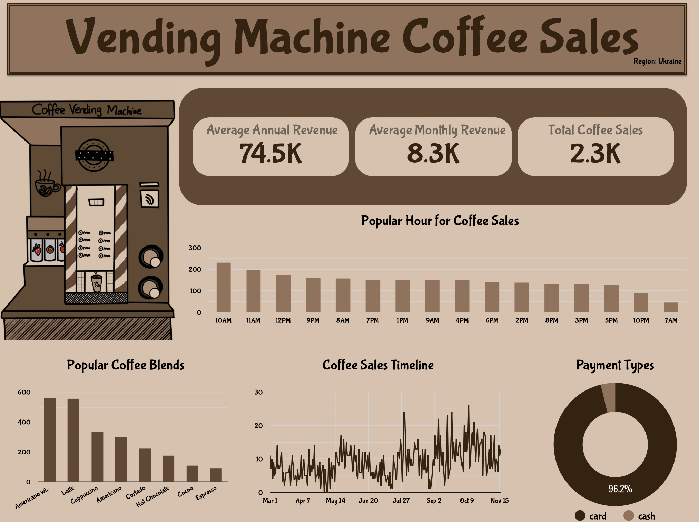

Coffee vending machines have become an integral part of various public and private spaces, offering a convenient way for people to grab a quick beverage.
As their presence grows, analyzing its sales data becomes crucial to understanding customer preferences, purchasing patterns, and sales trends.
### Objective of this project
* Identify Popular Hours to help the staff know when to refill the cups, coffee grains and other needs for the vending machine
* Identify Popular Coffee Blends
* Identify Purchasing Patterns
* Identify Coffee Trends (Eg. Hot Chocolate, purchased almost everyday in Fall)

### Data Structure
The data was taken from Kaggle.
The data represents purchases made using a coffee machine installed in a shopping center in Vinnytsia, Ukraine.
And the data spans from **March 1, 2024 to November 15, 2024.**

### Insights
Based on the dataset provided, the vending machine coffee sales made a total revenue of 74,500 UAH with an average monthly revenue of 8,300 UAH. Total number of coffees sold is 2,300 from March to mid November 2024.

*Popular Coffee Sales Duration*
Coffee sales peaked at 10 AM to Noon and followed by sales increase at 9 PM and 8 AM.
This is a key insight as it allows us to restock the vending machine more frequently during peak times, ensuring it never runs empty when people need it most.

*Popular Coffee Blends*
Based on our analysis Americano and Latte are the most commonly purchased coffee blends with Cappuccino being the third.
We also want to analyze the popular coffee blends to restock the necessary ingredients required for the most popular blend quite often so it doesn’t run out.

*Coffee Sales Seasonal Trends*
Identifying the coffee sales timeline can add value for restocking the popular blends.
For example, based on the dataset, Americano with Milk and Latte or most popular in almost all the months except in the Fall season.
In Fall, it looks like Hot Chocolate is the most popular as expected.
So having an idea about the seasonal trends, can help with identifying which blend requires frequent restocking.
Additionally, blending this insight with the ‘Popular Coffee Blends’ can have a exponential impact on making sales as there will less chances of running out of coffee blends on the respective seasons.

*Payment Types*
Based on the analysis, looks like cards are the most often used mode of payment. One caveat here is that, we don’t know what type of card it is, if it is a credit card or if it is like a food court coffee pass (RFID card). Less than 4% of people use cash.

### Recommendations
* Based on the identified trends, these are some of the recommendations that the business can look into for implementing that can improve the overall sales and operational efficiency:
* Since ~97% of the mode of payment is card, if it’s doable, make it a card only payment that way it can improve the operational efficiency.
* As we discovered that there is a peak in the hot chocolate blends in Fall, purchasing the inventories accordingly will lead to better customer satisfaction.
Continue logging the data for better insight, as the current data only spans for 9 months — more data can provide better insights

### Conclusion
By studying purchase patterns across different times of the day and throughout the week, this analysis seeks to uncover valuable insights.
It aims to identify peak sales hours, highlight the most popular beverages, and better understand customer buying behavior.
The findings will not only help evaluate the vending machine’s performance but also provide strategic recommendations to boost revenue and enhance customer satisfaction.
